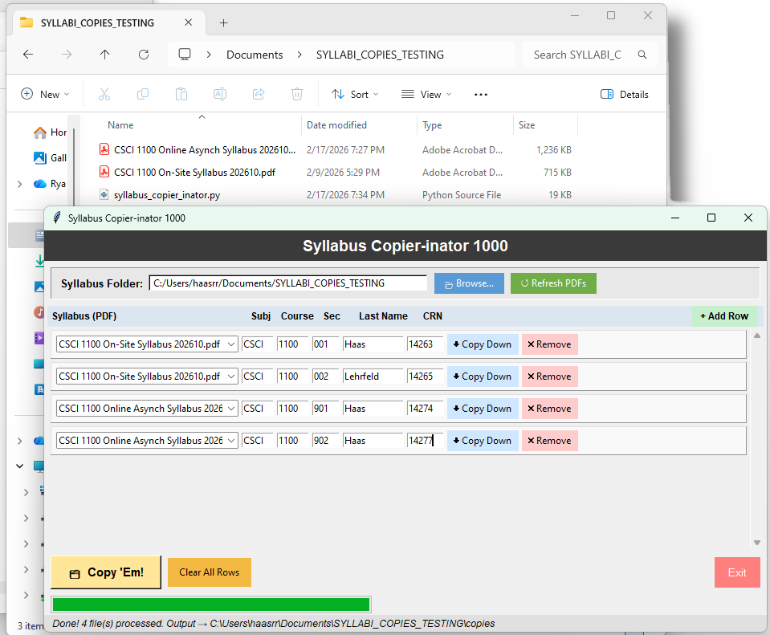
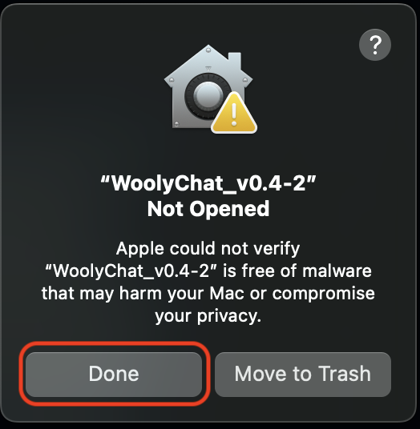
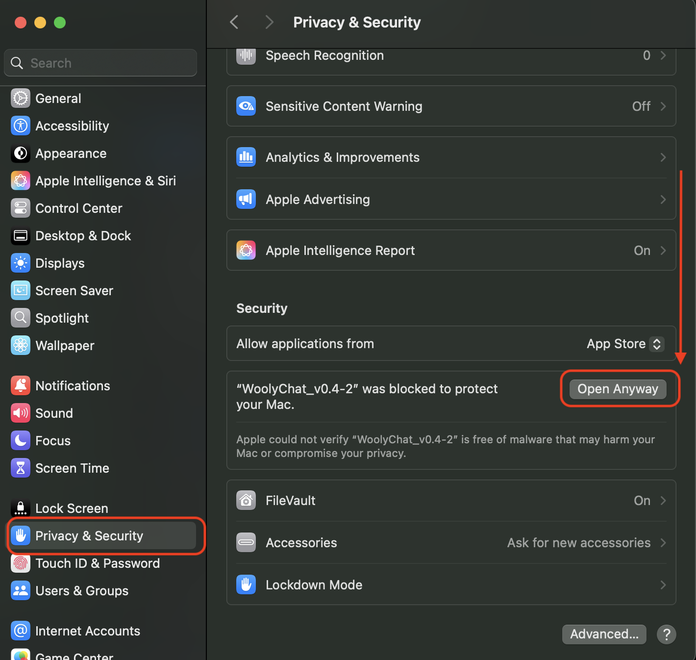

# 📄 Syllabus Copier-inator 1000

> Bulk-copy and rename syllabi to your university's required per-section filename format — in seconds, not minutes.

---

## Downloads (Executables)

| Platform | File | Version
|---|---|---|
| 🪟 **Windows** | [SyllabusCopierInator1000](https://github.com/ryan-etsu-computing-projects/syllabus-copier-inator/raw/refs/heads/main/releases/SyllabusCopierInator1000.exe) | 1000 |
| 🍎 **macOS** | [Syllabus Copier-Inator 1000](https://github.com/ryan-etsu-computing-projects/syllabus-copier-inator/raw/refs/heads/main/releases/Syllabus%20Copier-inator%201000.zip) | 1000 |

---



## ⚠️ First Launch Instructions ⚠️

Neither release is code-signed with a paid developer certificate, so Windows and macOS will both show a security warning the first time you open the app. This is expected. You're welcome to [review the full source code](syllabus_copier_inator.py) to verify it's safe before proceeding — it's a straightforward Python/Tkinter script that only reads and copies PDF files on your machine.

### 🪟 Windows

1. Double-click **`SyllabusCopierInator1000.exe`** to launch.
2. Windows Defender SmartScreen will likely block it with a warning dialog.
3. Click **"More info"** in that dialog.
4. Click **"Run anyway"**.

The app will open. You won't need to do this again on subsequent launches.

### 🍎 macOS

1. Unzip **`Syllabus Copier-Inator 1000.zip`** (if necessary) and move the app to your Applications folder (or wherever you'd like to keep it).
2. Double-click the app to launch. macOS will immediately show a pop-up saying it cannot verify the app is free of malware. Click **"Done"** to dismiss it — do *not* click "Move to Trash".
  


3. Open **System Settings** → **Privacy & Security** and scroll to the bottom of the page. You should see a message about the app being blocked, with an **"Open Anyway"** button. Click it.
   
4. Double-click the app again. This time it will open normally.



You only need to do this once. macOS will remember your choice for future launches.

---

## What It Does

At many universities, instructors are required to submit a separately-named PDF copy of their syllabus for every section they teach each semester — even when multiple sections share the exact same syllabus content. Renaming and copying files manually is tedious and error-prone.

**Syllabus Copier-inator 1000** automates this. You point it at a folder containing your syllabus PDFs, fill in a simple table of your course sections, and click a button. It copies each syllabus to the correct subfolder with the correct filename, ready to submit.

---

## How to Use It

### 1 — Select your syllabus folder

Click **Browse…** and select the folder containing your syllabus PDFs. The app will scan the folder and populate the syllabus dropdown with any PDFs it finds. If you add new files later, click **↺ Refresh PDFs**.

### 2 — Add your sections

Click **+ Add Row** to add a course section. Each row represents one copy that will be made:

| Field | Description |
|---|---|
| **Syllabus** | Which source PDF to copy from (dropdown of PDFs in your folder) |
| **Subject** | Department subject code, e.g. `CSCI` (up to 4 characters) |
| **Course** | 4-digit course number, e.g. `1100` |
| **Section** | 3-digit section number, e.g. `001` |
| **Last Name** | Instructor last name |
| **CRN** | 5-digit Course Reference Number, unique per section |

### 3 — Use Copy Down to work faster

Click **⬇ Copy Down** on any row to duplicate it directly below. The section number auto-increments (001 → 002), the CRN resets to `00000` as a reminder to fill it in, and everything else carries over. This makes it quick to add all sections of the same course.

### 4 — Copy 'Em!

Click **🗂 Copy 'Em!** when your table is complete. The app will validate all fields, then copy your files. Output is organized like this:

```
your_syllabus_folder/
  CSCI 1100 Online Asynch Syllabus 202610.pdf <-- Original file
  CSCI 1100 On-Site Syllabus 202610.pdf       <-- Original file
  copies/                                     <-- All your new copies
    CSCI 1100 On-Site Syllabus_copies/
      CSCI_1100_001_CRN_14263_Haas.pdf
      CSCI_1100_002_CRN_14265_Lehrfeld.pdf
    CSCI 1100 Online Asynch Syllabus_copies/
      CSCI_1100_901_CRN_14274_Haas.pdf
      CSCI_1100_902_CRN_14277_Haas.pdf
```

A summary dialog will confirm what was copied (and flag any errors).

---

## File Naming Convention

Copied files follow this format:

```
CSCI_1111_111_CRN_11111_LastName.pdf
```

Example: `CSCI_1100_001_CRN_14263_Haas.pdf`

---

*Built for the computing department, but works for any department — just change the Subject Code field.*
